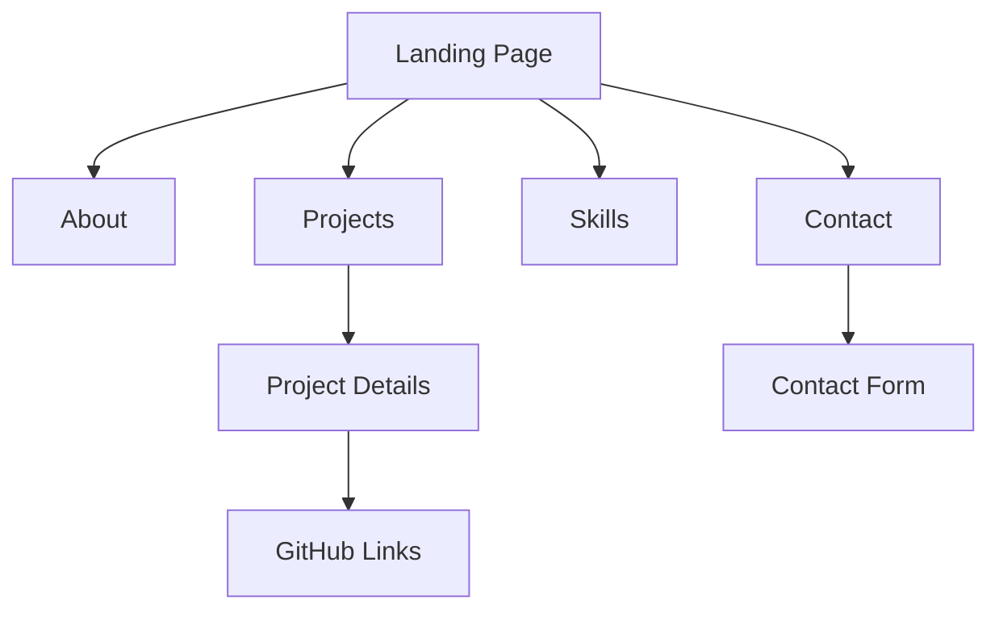
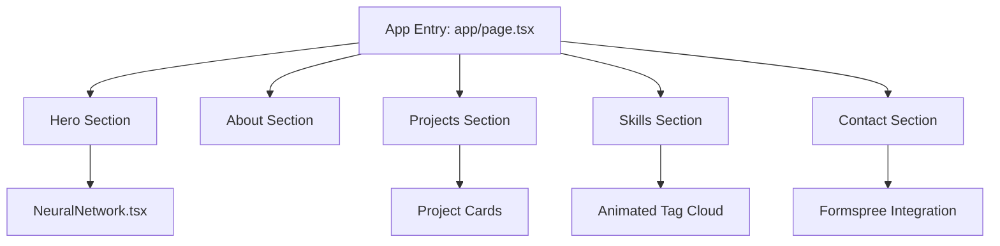
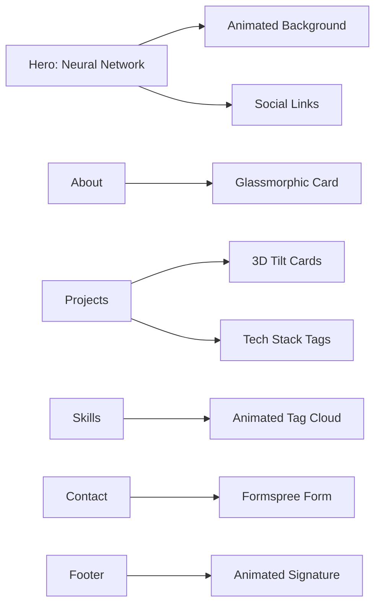

<!-- HEADER BANNER -->
<p align="center">
  
</p>


<!-- INTRODUCTION -->
<p align="center">
  <b>Futuristic, minimal, and immersive portfolio for Ansuman Panda.<br>
  Showcasing projects, skills, and creativity with interactive 3D and modern UI.</b>
</p>

---

<!-- USER FLOW DIAGRAM -->
## 🗺️ User Flow



---

<!-- TECH STACK TABLE -->
## 🛠️ Tech Stack

| Frontend         | Styling         | Animation         | 3D/Graphics         | Utilities         | Type System   |
|------------------|----------------|-------------------|---------------------|-------------------|--------------|
|  |  |  |  |  |  |

---

<!-- PACKAGES TABLE -->
## 📦 Key Packages

| Package                        | Version     | Description                                      |
|--------------------------------|-------------|--------------------------------------------------|
| next                           | ^14.0.4     | React framework for production web apps           |
| react                          | ^18.2.0     | UI library for building interactive interfaces    |
| tailwindcss                    | ^3.3.6      | Utility-first CSS framework                       |
| framer-motion                  | ^10.16.16   | Animation and gesture library for React           |
| three                          | 0.157.0     | 3D graphics engine for the web                    |
| @react-three/fiber             | 8.13.7      | React renderer for Three.js                       |
| @studio-freight/react-lenis    | ^0.0.47     | Smooth scroll utility for React                   |

---

<!-- FILE STRUCTURE -->
## 📁 File Structure

<details>
<summary>Click to expand</summary>

```
Portfolio_website/
├── app/
│   ├── globals.css
│   ├── layout.metadata.ts
│   ├── layout.tsx
│   └── page.tsx
├── components/
│   ├── About.tsx
│   ├── AboutSection.tsx
│   ├── Brain3D.tsx
│   ├── BrainBackground.tsx
│   ├── BrainModel.tsx
│   ├── Contact.tsx
│   ├── Education.tsx
│   ├── Footer.tsx
│   ├── Hero.tsx
│   ├── Hero3D.tsx
│   ├── LenisProvider.tsx
│   ├── Navbar.tsx
│   ├── NeuralNetwork.tsx
│   ├── Projects.tsx
│   ├── Scene.tsx
│   ├── ScrollProgress.tsx
│   └── Skills.tsx
├── lib/
│   └── animations.ts
├── public/
│   ├── models/
│   │   └── human-brain.glb
│   ├── profile.jpg
│   └── README.md
├── FORMSPREE_SETUP.md
├── next-env.d.ts
├── next.config.js
├── package.json
├── postcss.config.js
├── README.md
├── tailwind.config.ts
├── tsconfig.json
└── vercel.json
```
</details>

---

<!-- INSTALLATION -->
## 🚀 Installation

```bash
# Clone the repository
git clone https://github.com/Ansuman11055/ansuman-portfolio.git
cd ansuman-portfolio

# Install dependencies
npm install

# Start the development server
npm run dev
```

Open [http://localhost:3000](http://localhost:3000) in your browser to view the site.

---

<p align="center">
  <b>Designed with logic and creativity</b> 🧠✨
</p>
# Ansuman Panda - Portfolio Website

A futuristic, minimal, and immersive portfolio website for Ansuman Panda, Machine Learning Engineer from IIT Mandi ('28).

## 🎨 Design Philosophy

This portfolio merges clean visual storytelling with interactive, tech-driven design language. It features:

- **Dark futuristic theme** with fluid animations
- **Glassmorphism** effects and subtle gradients
- **Neural network animation** in the hero section
- **Scroll-triggered transitions** for smooth storytelling
- **3D hover effects** on project cards
- **Responsive design** for all devices

## 🚀 Tech Stack

- **Framework**: Next.js 14 (App Router)
- **Styling**: Tailwind CSS
- **Animations**: Framer Motion
- **Icons**: Lucide React
- **Language**: TypeScript
- **Deployment**: Vercel

## 📦 Installation

```bash
# Install dependencies
npm install

# Run development server
npm run dev

# Build for production
npm run build

# Start production server
npm start
# 🧠 3D Brain Model & GLB Usage

## How the Brain Was Created

The interactive 3D brain is rendered using [Three.js](https://threejs.org/) and [@react-three/fiber](https://docs.pmnd.rs/react-three-fiber/getting-started/introduction). The model itself is a `.glb` (GLTF Binary) file, created and exported from Blender:

1. **Modeling:** A human brain mesh was sourced or sculpted in Blender.
2. **Wireframe Effect:** The mesh is rendered in wireframe mode with layered neon colors for a futuristic look.
3. **Export:** The model is exported as `human-brain.glb` (File → Export → glTF 2.0 (.glb)).
4. **Usage:** The file is placed in `public/models/human-brain.glb` and loaded in the app using `useGLTF` from `@react-three/drei`.

<details>
<summary>Code Example: Loading the Brain Model</summary>

```tsx
import { useGLTF } from '@react-three/drei';
const { scene } = useGLTF('/models/human-brain.glb');
```
</details>

## How to Add or Replace 3D Models

1. **Create or download** a `.glb` model (e.g., from Blender, Sketchfab, etc.).
2. **Place** the file in `public/models/` (e.g., `public/models/your-model.glb`).
3. **Load** it in your component:

```tsx
const { scene } = useGLTF('/models/your-model.glb');
```

## Tips for GLB Files

- Keep models optimized (low poly, compressed textures) for fast loading.
- Use descriptive, lowercase filenames.
- Test in [gltf-viewer.donmccurdy.com](https://gltf-viewer.donmccurdy.com/) before using in your app.

---

# 📄 License

© 2024 Ansuman Panda. All rights reserved.

---

<p align="center">
  <b>Designed with logic and creativity</b> 🧠✨
</p>
  
</p>

---

<p align="center">
  
  
  
  
  
</p>

---

# 🚀 Overview

A futuristic, minimal, and immersive portfolio for Ansuman Panda (ML Engineer, IIT Mandi '28) blending:
- **Dark, glassmorphic UI**
- **3D neural network hero animation**
- **Fluid scroll & transitions**
- **3D project cards**
- **Responsive, accessible design**

---

# 🧩 Project Structure



---

# 🛠️ Tech Stack & Packages

| Category      | Packages Used                                                                 |
|--------------|-------------------------------------------------------------------------------|
| Framework    | next, react, react-dom                                                        |
| Styling      | tailwindcss, postcss, autoprefixer                                            |
| Animations   | framer-motion, gsap                                                           |
| 3D/Graphics  | three, @react-three/fiber, @react-three/drei, @react-three/postprocessing,    |
|              | postprocessing, three-stdlib, troika-three-text                               |
| Utilities    | @studio-freight/react-lenis, react-icons, lucide-react                        |
| Types        | typescript, @types/react, @types/node, @types/three, @types/react-dom         |
| Linting      | eslint, eslint-config-next                                                    |

---

# 📦 Installation & Usage

```bash
# 1. Install dependencies
npm install

# 2. Start development server
npm run dev

# 3. Build for production
npm run build

# 4. Start production server
npm start
```

Visit [http://localhost:3000](http://localhost:3000) to view your site.

---

# 🌟 Features at a Glance



- **Hero:** Animated neural network, interactive particles, social links
- **About:** Glassmorphic card, highlights, reveal animations
- **Projects:** 3D tilt cards, GitHub links, tech tags
- **Skills:** Animated tag cloud, hover effects
- **Contact:** Glassmorphic form, direct links, hover glow
- **Footer:** Animated signature, scroll-to-top

---

# 🎨 Color Palette

| Color Name     | Hex        |
|---------------|------------|
| Deep Navy     | #0a0e27    |
| Carbon Black  | #0d1117    |
| Neon Blue     | #00d4ff    |
| Neon Purple   | #a855f7    |

---

# 📱 Responsive Design

- Desktop (1920px+)
- Laptop (1024px - 1919px)
- Tablet (768px - 1023px)
- Mobile (320px - 767px)

---

# 🌐 Deployment

## Deploy to Vercel

1. Push your code to GitHub
2. Import project to Vercel
3. Deploy with one click

Or use the Vercel CLI:

```bash
npm install -g vercel
vercel
```

---

# 📧 Contact

- **Email:** ansuman11c5@gmail.com
- **GitHub:** [Ansuman11055](https://github.com/Ansuman11055)
- **LinkedIn:** [Ansuman Panda](https://www.linkedin.com/in/ansuman11055)

---

# 📄 License

© 2024 Ansuman Panda. All rights reserved.

---

<p align="center">
  <b>Designed with logic and creativity</b> 🧠✨
</p>