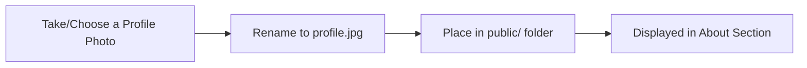
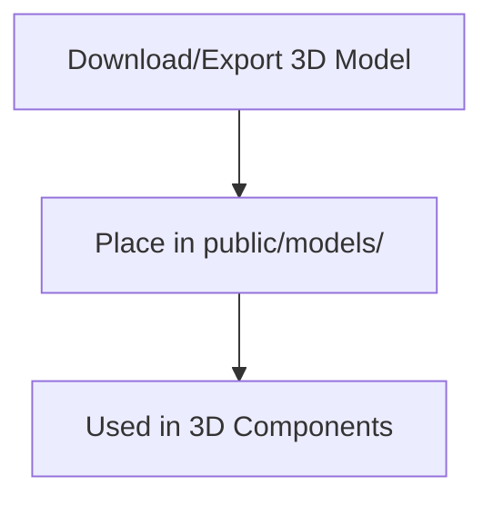

	

# 🗂️ Public Assets Guide

This folder contains all static assets used in the portfolio website, such as images and 3D models.

---

## 👤 Profile Image

	

**How to add your profile photo:**

- Name the file **exactly**: `profile.jpg`
- Format: JPG/JPEG
- Recommended size: **800x800px** or higher
- Center your face in the image

The About section will display this image in a circular, glowing neon frame.

---

## 📦 3D Models

Place any 3D models (GLB, GLTF, etc.) in the `public/models/` folder.

---

## 📝 Asset Usage Tips

- Use optimized images for faster load times
- Keep filenames lowercase and descriptive
- Remove unused assets to keep the folder clean

---

	<b>Every asset tells your story visually!</b> 🎨

